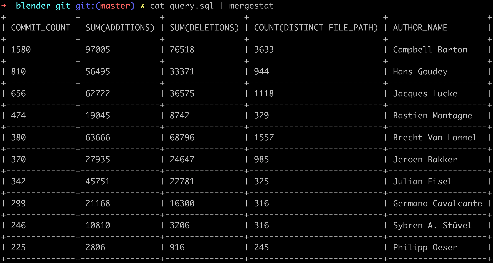
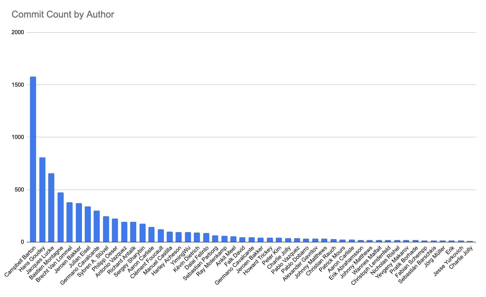
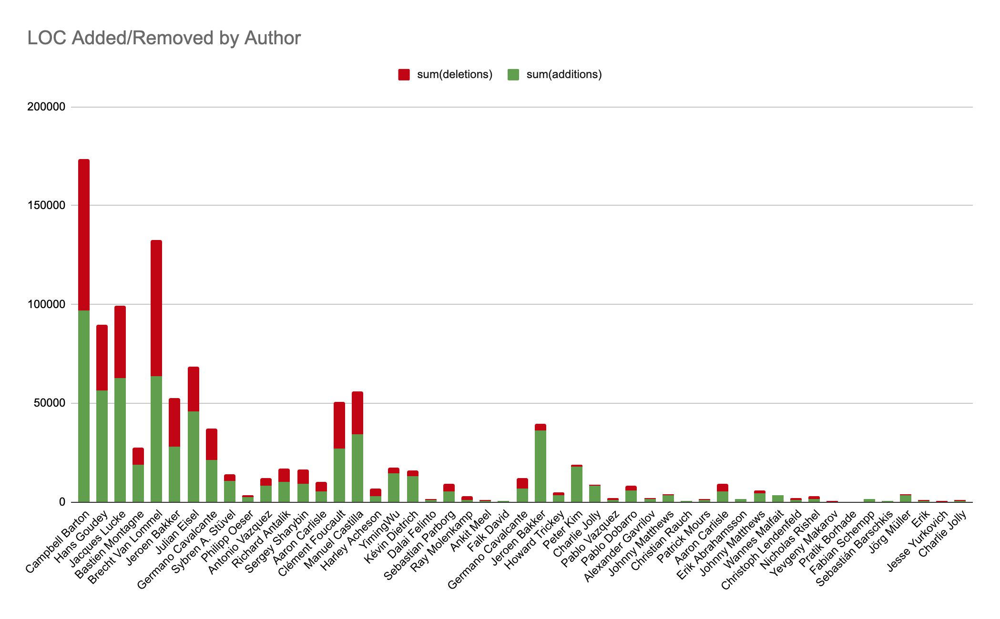
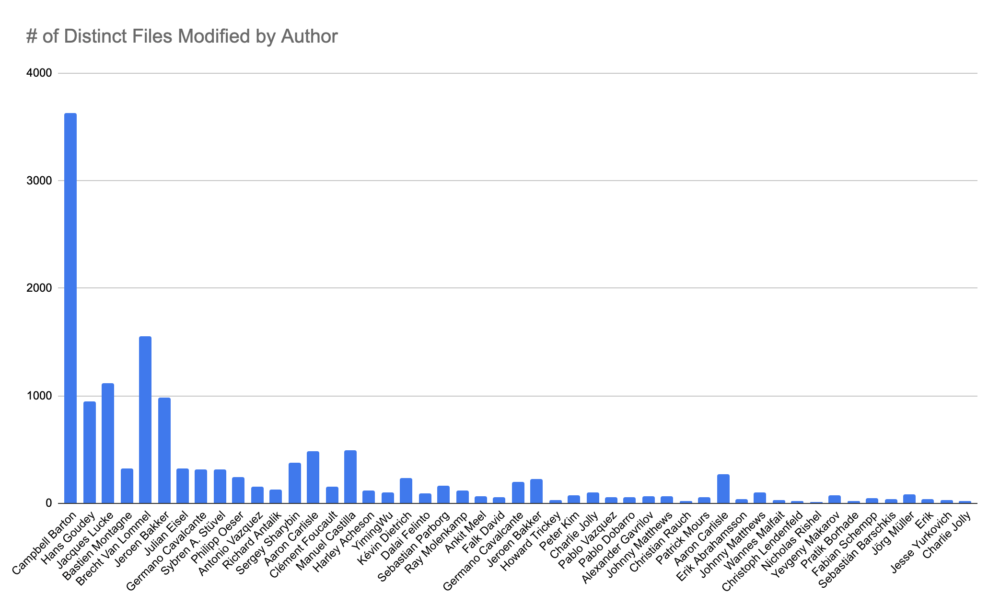

# A Year in Commits 🎊 📊 

It's a new year, and [a post](https://www.blender.org/development/top-30-committers-2021/) listing the top 30 committers to the [Blender project](https://developer.blender.org/diffusion/B/) in 2021 was on the front-page of HN this morning.

> Below is the list of top committers to the Blender project in 2021. The amount of commits obviously doesn’t mean much, but it’s a neutral metric to put limelight on people who made Blender possible last year.

As the post says, counting commits doesn't mean much alone, but it's a decent proxy for *relative* activity within a codebase.
As a maintainer of the [MergeStat project](https://github.com/mergestat/mergestat), a SQL interface to data in git, I wanted to show how to make a similar list for any repo, and take it a step further with some additional metrics.

:::info

Take a look at our [**CLI guide**](https://docs.mergestat.com/getting-started-cli/installation) to run the following queries yourself, on any repo.

:::

## Top 30 Contributors by Commit Count

Replicating the list in the original blog post can be done with the following query:

```sql
SELECT
    count(*), author_name, author_email
FROM commits
WHERE parents < 2 -- ignore merge commits
AND strftime('%Y', author_when) = '2021' -- commits only authored in 2021
GROUP BY author_name, author_email
ORDER BY count(*) DESC
LIMIT 30
```

This yields a list of names (ordered and with counts) very similar to what's in the original post 🙂.

## Adding Commit Stats

The [**`stats` table**](https://docs.mergestat.com/reference/git-tables#stats) allows us to also look at the **number of files modified** in each commit as well as **LOC added or removed**.
We can join the `stats` table with `commits` to measure:

1. Total lines added by a contributor
2. Total lines removed by a contributor
3. Distinct files modified by a contributor
   
In addition to just counting the number of commits.



```sql
SELECT
    count(DISTINCT hash) AS commits,
    sum(additions),
    sum(deletions),
    count(DISTINCT file_path),
    author_name, author_email
FROM commits, stats('', commits.hash)
WHERE parents < 2 -- ignore merge commits
AND strftime('%Y', author_when) = '2021' -- commits only authored in 2021
GROUP BY author_name, author_email
ORDER BY count(*) DESC
LIMIT 30
```

Similar to counting commits, LOC added or removed doesn't mean much indepedently.
Files modified (distinct files changed by an author over the year) is a bit more interesting - depending on the size/nature of a codebase, **it could be a measure of how "deeply" involved a particular contributor is** - i.e. someone who contributes to all aspects of the project, not just a subset of it.

## Making Some Graphs

Finally, by adding the `--format csv` flag to the **`mergestat`** command when executing the above queries, we can copy the output into a spreadsheet to make some charts.







These queries should be portable to your own repositories (or any other).
Try them out in our **[web app](https://app.mergestat.com/w/public)** or with our **[CLI](https://github.com/mergestat/mergestat)**.

:::info Join our Slack

We've recently launched a [**community Slack**](https://join.slack.com/t/mergestatcommunity/shared_invite/zt-xvvtvcz9-w3JJVIdhLgEWrVrKKNXOYg) - feel free to stop in if you have questions or anything to share 🎉.

:::
