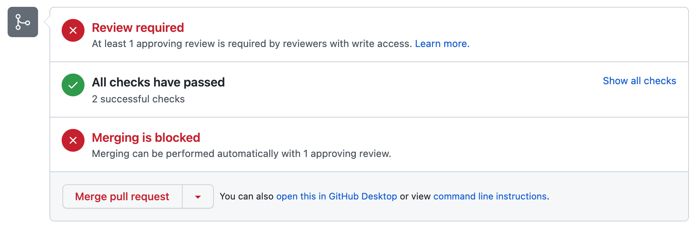
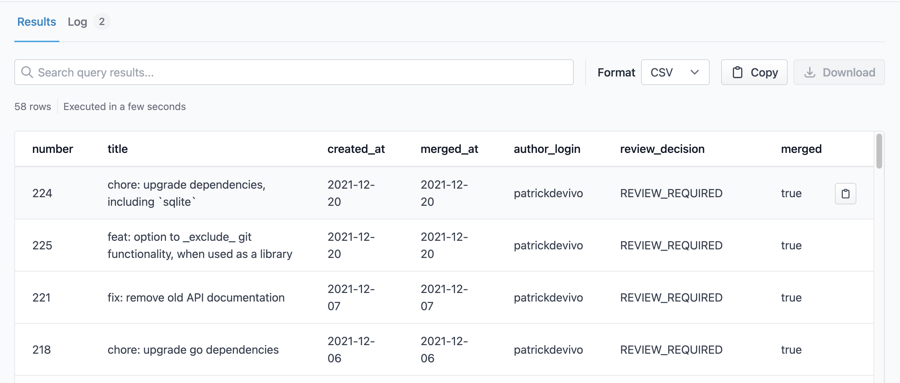

We had a user looking for a way to track merged GitHub pull requests that were **unapproved** (when merged into a `main` branch).
This is typically done with an "Admin Override" when merging a PR, or from loose branch protection rules allowing for unapproved merges into a branch.



Allowing repo administrators to merge without a review can be a useful shortcut for "emergency" hotfixes that avoid a potentially time-consuming code review cycle.
This of course depends on the habits and culture of your engineering organization.


*Too many* unapproved merges, however, is probably a sign of something wrong (again, depending on the organization and codebase).
For instance, a high volume of "emergency fixes" shipping without any review, or developers simply short-circuiting the review cycle to get code merged/deployed quickly.

## Surfacing Unapproved, Merged PRs

The following [**MergeStat**](https://docs.mergestat.com/) query will **list all unapproved pull requests merged into the `main` branch**.

```sql
SELECT
    number,
    title,
    date(created_at) AS created_at,
    date(merged_at) AS merged_at, 
    author_login,
    review_decision,
    merged
FROM github_prs('mergestat', 'mergestat') -- set to your own repo
WHERE
    merged = true
    AND review_decision <> 'APPROVED'
    AND base_ref_name = 'main' -- set to your own branch
ORDER BY created_at DESC
```

This will yield a table that looks [something like](https://app.mergestat.com/w/public/query/q/8c9816ec-9c4e-4518-85a0-3ff95ae4566c) (in our [web app](https://app.mergestat.com/)):



If you'd like to know which GitHub users most frequently merge without an approval, you can run the following:

```sql
SELECT
    count(*), merged_by
FROM github_prs('mergestat', 'mergestat')
WHERE
    merged = true
    AND review_decision <> 'APPROVED'
    AND base_ref_name = 'main'
GROUP BY merged_by
ORDER BY count(*) DESC
```

which will display an ordered list of the most common "unapproved mergers" in a codebase.

## Additional Ideas

1. Filter by `created_at` or `merged_at` if you only care about recently merged PRs
2. Query for unapproved (and merged) PRs across an *entire GitHub org* (rather than a single repo)
3. Create a Slack/Discord bot that alerts when an unnapproved PR is merged, or shares a monthly report
4. Track in a dashboard (a line chart) to record instances over time

:::info Join our Slack

We've recently launched a [**community Slack**](https://join.slack.com/t/mergestatcommunity/shared_invite/zt-xvvtvcz9-w3JJVIdhLgEWrVrKKNXOYg) - feel free to stop in if you have questions or anything to share 🎉.

:::
