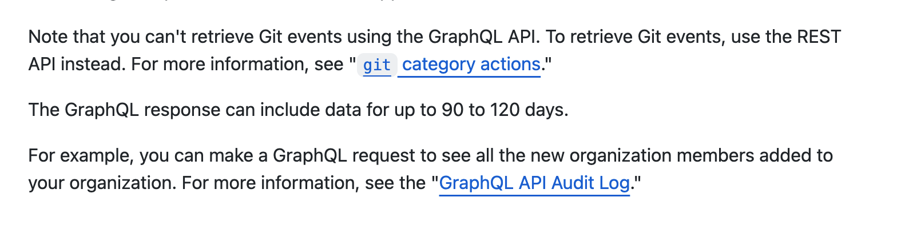

For organizations using GitHub Enterprise, the GitHub audit log is now supported as a [table in the MergeStat CLI](https://github.com/mergestat/mergestat/releases/tag/v0.5.8), enabling SQL queries against audit log events 🎉. **[Check it out!](https://github.com/mergestat/mergestat)**

The new table-value-function is `github_org_audit_log`, and may be queried like so:

```sql
SELECT * FROM github_org_audit_log('mergestat') -- replace with your org name
```

and has the following columns ([type](https://www.sqlite.org/datatype3.html) is `TEXT` unless otherwise specified):

- `id`
- `entry_type`
- `action`
- `actor_type`
- `actor_login`
- `actor_ip`
- `actor_location` (**JSON**)    
- `created_at` (**DATETIME**)
- `operation_type`
- `user_login`

:::caution GitHub Enterprise Only

This feature only works with [GitHub Enterprise organizations](https://docs.github.com/en/enterprise-cloud@latest/organizations/keeping-your-organization-secure/managing-security-settings-for-your-organization/reviewing-the-audit-log-for-your-organization#using-the-audit-log-api), since the audit log API is only available to enterprise accounts.

:::

This enables some interesting use-cases for GitHub enterprise users looking to monitor, alert and report on events from the GitHub audit log.
We're working with some early users of this table, and will publish some guides and examples in the near future 🔜.

**It's important to note the following from the [GitHub API docs](https://docs.github.com/en/enterprise-cloud@latest/organizations/keeping-your-organization-secure/managing-security-settings-for-your-organization/reviewing-the-audit-log-for-your-organization#using-the-audit-log-api) as well:**



:::info Join our Slack

Our [**community Slack**](https://join.slack.com/t/mergestatcommunity/shared_invite/zt-xvvtvcz9-w3JJVIdhLgEWrVrKKNXOYg) is a great place to find help and ask questions. We're always happy to chat about **MergeStat** there 🎉!

:::
