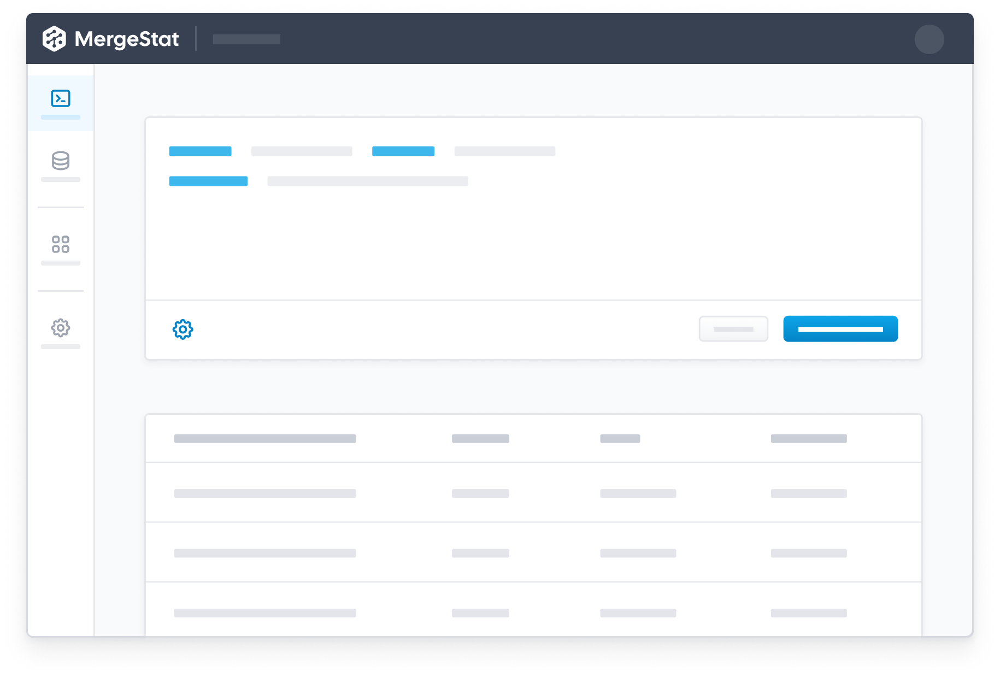

# MergeStat now has a SQL Query Interface

Today we're excited to announce the availability of in-app SQL querying in the latest [versions of MergeStat](https://github.com/mergestat/mergestat/releases)! 🎉

One of the more significant pain points noted by our early adopters has been the need for *external* tools to access the data MergeStat provides, even for simple, one-off queries.
Many users (ourselves included) lean on existing data products such as [Grafana](https://grafana.com/), [Metabase](https://www.metabase.com/) and [Superset](https://superset.apache.org/) to consume MergeStat data (in dashboards, alerts and reports).

With the addition of our query interface (in the `Queries` tab of our management console), MergeStat users can now execute SQL directly in our app.

Query results can be copied or downloaded as CSV or JSON, for quick use in other tools and contexts.
We believe this is a significant step-forward in our app's functionality, and will continue to invest in this area of our management console.
Keep a lookout for additional features, including:

- Saved and examples queries
- Inline schema documentation and editor auto-completions
- Basic charting and data visualization
- Query execution history

It's important to note that **as always, the MergeStat PostgreSQL database can be connected directly to** by BI tools, desktop SQL clients, or SQL drivers.

Check out the latest [**MergeStat**](https://github.com/mergestat/mergestat) release to get started!

:::info Join our Slack

Our [**community Slack**](https://join.slack.com/t/mergestatcommunity/shared_invite/zt-xvvtvcz9-w3JJVIdhLgEWrVrKKNXOYg) is a great place to find help and ask questions. We're always happy to chat about **MergeStat** there 🎉!

:::
