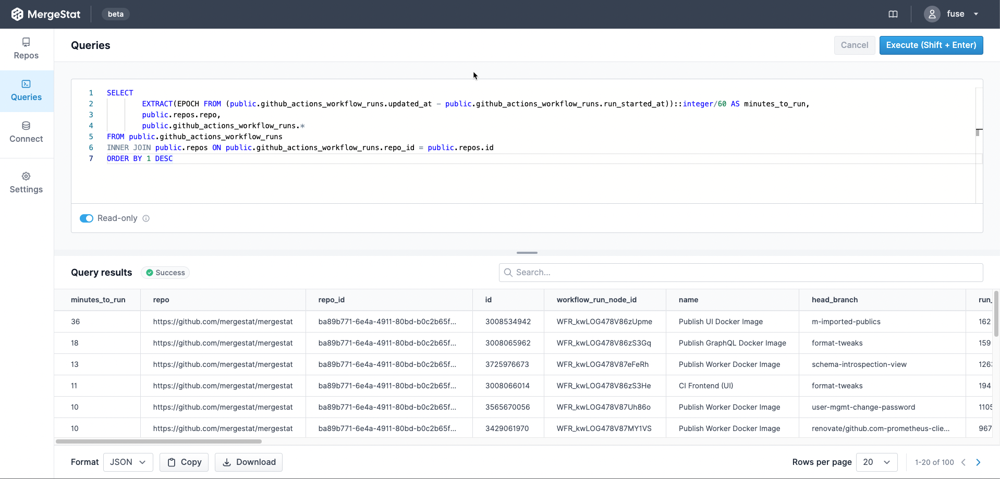

Recently, [MergeStat](https://github.com/mergestat/mergestat) added support for collecting data from [GitHub Actions](https://github.com/features/actions).
We wanted a way to start asking questions about our CI pipelines, and very soon we were able to leverage MergeStat to surface useful results.

## Finding Our Most Expensive CI Pipelines

Last year we received a GitHub bill that surprised us.
We had an expensive charge related to GitHub Actions minutes, even though most of our repos are public (Actions usage is free for public repos).
We ended up finding a couple of experimental workflows in private repos that were the culprits of the higher-than-usual costs.

To find these, we [exported](https://docs.github.com/en/billing/managing-billing-for-github-actions/viewing-your-github-actions-usage) our raw Actions usage data into a spreadsheet, aggregated the minutes, and ordered by the most expensive repos.
This wasn't *too* difficult, but it made us think about how valuable it could be to always have this data on hand, with the ability to query it ad-hoc (vs needing to run an export, load a spreadsheet and run some formulas every time).

Now that we have GitHub Actions data syncing with MergeStat, we're able to do this:

```sql
-- find our longest running CI jobs
SELECT 
    EXTRACT(EPOCH FROM (public.github_actions_workflow_runs.updated_at - public.github_actions_workflow_runs.run_started_at))::integer/60 AS minutes_to_run,
    public.repos.repo,
    public.github_actions_workflow_runs.*
FROM public.github_actions_workflow_runs
INNER JOIN public.repos ON public.github_actions_workflow_runs.repo_id = public.repos.id
ORDER BY 1 DESC
```


## Improving DevEx by Finding Long Running Tests

In a very related use case, a partner reached out asking how to use MergeStat to query for *long running tests*.
Long running tests can be a significant bottleneck in a software-delivery pipeline, especially at scale.
This impacts developer experience and the rate at which teams can deliver value to production.

We were able to tweak the query above to answer this question.
In short, we filtered out workflow runs that had a name that included the string `test`, which was good enough for the situation at hand:

```sql
SELECT 
    EXTRACT(EPOCH FROM (public.github_actions_workflow_runs.updated_at - public.github_actions_workflow_runs.run_started_at))::integer/60 AS minutes_to_run,
    public.repos.repo,
    public.github_actions_workflow_runs.*
FROM public.github_actions_workflow_runs
INNER JOIN public.repos ON public.github_actions_workflow_runs.repo_id = public.repos.id
WHERE public.github_actions_workflow_runs.name ilike '%test%'
ORDER BY 1 DESC
```

## Next Up
These two examples hopefully convey the value of having this type of CI/CD data on hand and accessible with SQL.
Since this data can sit next to pull requests, commist, code, issues and more, we can augment these queries with additional dimensions to get deeper insights into engineering operations overall.

In addition, we're working on some exciting features that will make accessing and using this data much easier.
In particular, saved queries, charts, dashboards, reports and alerts will make it possible to use this data more effectively.

- Visualize which repos or teams are using the most CI minutes.
- Send a Slack alert when a CI run takes longer than 15 minutes.
- Track improvements in CI runtimes over different periods and teams, use it to celebrate or communicate up.

Regardless, MergeStat's mission continues to be in service of **data agility** for software engineering.
[Check us out](/mergestat/getting-started/running-locally/)!

:::info Join our Slack

Our [**community Slack**](https://join.slack.com/t/mergestatcommunity/shared_invite/zt-xvvtvcz9-w3JJVIdhLgEWrVrKKNXOYg) is a great place to find help and ask questions. We're always happy to chat about **MergeStat** there 🎉!

:::
