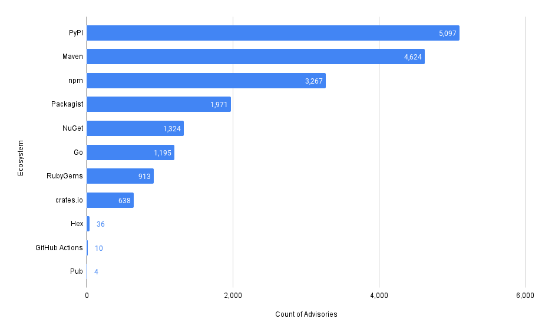
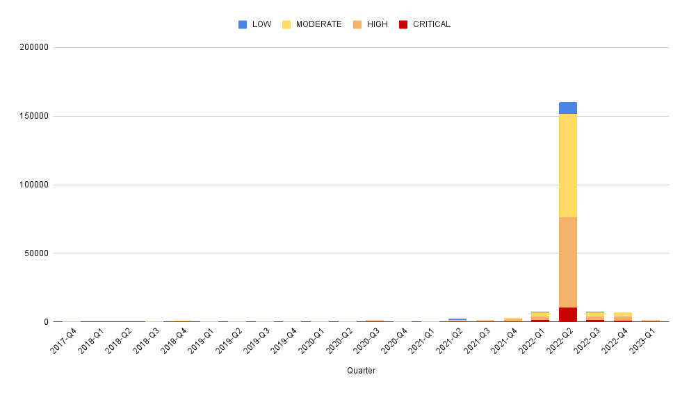

# Using SQL on the GitHub Security Advisory Git Repo 🛡️

Did you know that GitHub maintains **[a public database](https://github.com/github/advisory-database)** of known CVEs and security advisories for open-source codebases?
The database is a public Git repository that holds JSON files in [OSV format](https://ossf.github.io/osv-schema/), partitioned by date.
This is the data that's displayed on the [`github.com/advisories`](https://github.com/advisories) page, which also powers [Dependabot alerts](https://docs.github.com/en/code-security/dependabot/dependabot-alerts/about-dependabot-alerts)!

Since it's just a Git repo, we wanted to take it for a spin with [MergeStat](https://github.com/mergestat/mergestat) to see what we could learn applying some SQL to its contents.

## Setup

We followed the [getting started instructions](/mergestat/getting-started/running-locally/) to get a new local instance of MergeStat running with `docker-compose`.
Since this is a public GitHub repo (and we're looking at the data brought in by the [`GIT_FILES`](/mergestat/querying/schema/tables/git_files) syncer), we don't need to configure any authentication, we can just bring the repo in directly, and sync the file contents:

[](github-advisory-database-files-sync.jpg)

We started by establishing a view over the "raw" file contents of the repo, which extracts some values from the underlying JSON files and parses their file paths:

```sql
-- View of all GitHub Advisories in the repo
CREATE OR REPLACE VIEW github_advisories AS (
    SELECT
        path,
        split_part(path, '/', 2) as reviewed,
        split_part(path, '/', 3) as year,
        split_part(path, '/', 4) as month,
        split_part(path, '/', 5) as id,
        contents::jsonb->>'summary' as summary,
        contents::jsonb->'database_specific'->>'severity' as severity,
        a.value->'package'->'name' as affected_name,
        a.value->'package'->'ecosystem' as affected_ecosystem
    FROM git_files LEFT JOIN LATERAL jsonb_array_elements(contents::jsonb->'affected') a ON true
    WHERE path LIKE 'advisories/%.json'
)
```

This allows us to run much cleaner queries, such as:

```sql
SELECT * FROM github_advisories
```

[](sql-listing-advisories.jpg)

without needing to carry over the parsing and JSON logic in every query we run.

## How many advisories are reviewed vs unreviewed?

```sql
SELECT
    count(1) as total,
    count(1) FILTER (WHERE reviewed = 'github-reviewed') as reviewed,
    count(1) FILTER (WHERE reviewed = 'unreviewed') as unreviewed
FROM github_advisories
```

- **201,711** total advisories (at time of writing)
- **19,078** advisories have been reviewed by GitHub (~9% of total)
- **182,633** remain unreviewed

(Clearly the GitHub team has quite a bit on their plate 😀)

## How many advisories exist by ecosystem?

Ecosystem here refers to the package registry the advisory was found in.
Looks like `PyPi` has the most and `Pub` the least.
Note that we're excluding results where an affected ecosystem is not listed.

```sql
SELECT
    affected_ecosystem,
    count(*)
FROM github_advisories
WHERE affected_ecosystem IS NOT NULL -- where the affected ecosystem is known
GROUP BY affected_ecosystem
ORDER BY count(*) DESC
```

[](advisories-by-ecosystem.png)

## How many advisories exist by ecosystem *and* severity?

Severity here is one of `CRITICAL`, `HIGH`, `MODERATE`, and `LOW`.

```sql
SELECT
    affected_ecosystem,
    severity,
    count(*)
FROM github_advisories
WHERE affected_ecosystem IS NOT NULL -- where the affected ecosystem is known
GROUP BY affected_ecosystem, severity
ORDER BY count(*) DESC

```
[](advisories-by-ecosystem-and-severity.png)

Some ecosystems have fewer advisories overall, but a higher percentage of those advisories are `CRITICAL`.

## How many advisories have been published over time?

```sql
SELECT
    extract(year from published) || '-Q' ||extract(quarter from published) as quarter,
    count(*)
FROM github_advisories
GROUP by extract(year from published), extract(quarter from published)
ORDER BY extract(year from published) ASC, extract(quarter from published) ASC
```

[](advisories-by-quarter.png)

Looks like *a ton* of advisories were published in Q2 2022, making it hard to see overall trends.

## What's been the makeup of advisory severity over time?

```sql
SELECT
    extract(year from published) || '-Q' ||extract(quarter from published) as quarter,
    severity,
    count(*)
FROM github_advisories
GROUP by extract(year from published), extract(quarter from published), severity
ORDER BY extract(year from published) ASC, extract(quarter from published) ASC
```
[](advisories-by-quarter-by-severity.png)

[](advisories-by-quarter-by-severity-100-stacked.png)
*With 100% stacking*

## What's been the makeup of advisory ecosystem over time?

```sql
SELECT
    extract(year from published) || '-Q' ||extract(quarter from published) as quarter,
    affected_ecosystem,
    count(*)
FROM github_advisories
GROUP by extract(year from published), extract(quarter from published), affected_ecosystem
ORDER BY extract(year from published) ASC, extract(quarter from published) ASC
```

[](advisories-by-quarter-by-ecosystem.png)

(Where the ecosystem is known).
