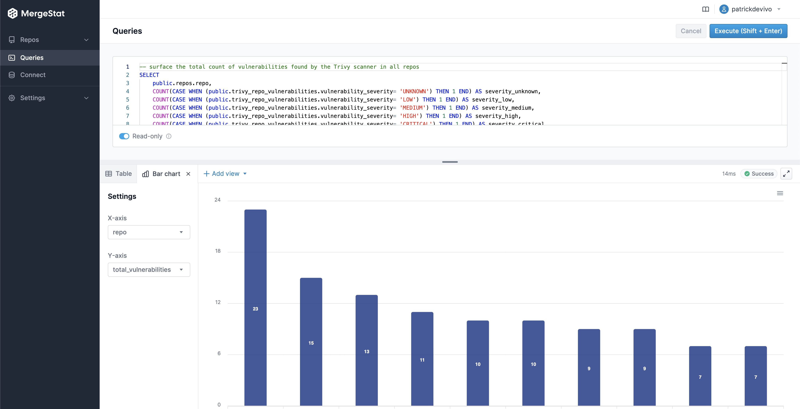
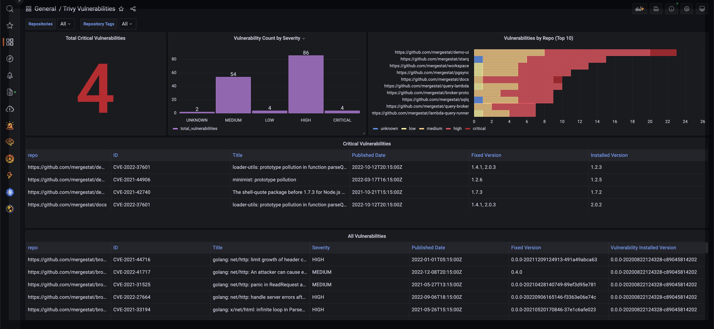

# MergeStat, Now With Data Visualization 📊

We're excited to announce that the [most recent releases](https://github.com/mergestat/mergestat/releases/tag/v1.13.0-beta) of MergeStat now include basic data visualization capabilities - [try it out](https://docs.mergestat.com/mergestat/getting-started/running-locally/)!

We're starting small, with simple support for **line charts 📈** and **bar charts 📊** in our SQL execution interface.
We've also added a **single metric** view type which will feed into the dashboarding capabilities we have planned (along with our other chart types).

This has been one of the more frequently requested features from our early users, as it now means you don't *have* to bring in another BI tool (such as [Grafana](https://grafana.com/), [Metabase](https://www.metabase.com/), [Superset](https://superset.apache.org/), etc.) to visualize the data in your [MergeStat](https://github.com/mergestat/mergestat) instance.
Support for direct SQL access is not going anywhere however, and nothing prevents more robust data visualizations in other tools.

*Example of MergeStat data visualization in Grafana*

** Keep a Lookout for:**

- More chart types, such as scatter plots and pie/donut charts
- More chart options and customization abilities
- Saved queries and visualizations for easier reuse
- Dashboard composition for putting together dynamic, SQL-driven reports on MergeStat data

:::info Join our Slack

Our [**community Slack**](https://join.slack.com/t/mergestatcommunity/shared_invite/zt-xvvtvcz9-w3JJVIdhLgEWrVrKKNXOYg) is a great place to find help and ask questions. We're always happy to chat about **MergeStat** there 🎉!

:::
