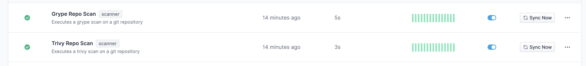
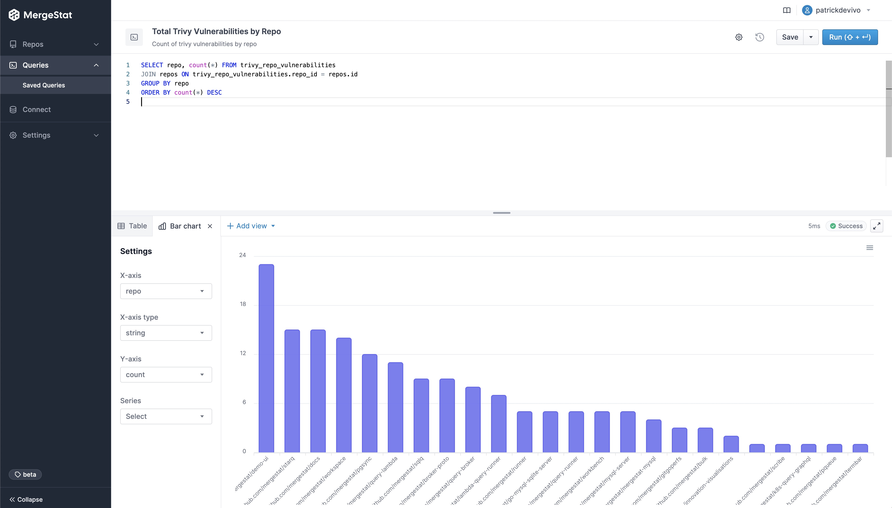
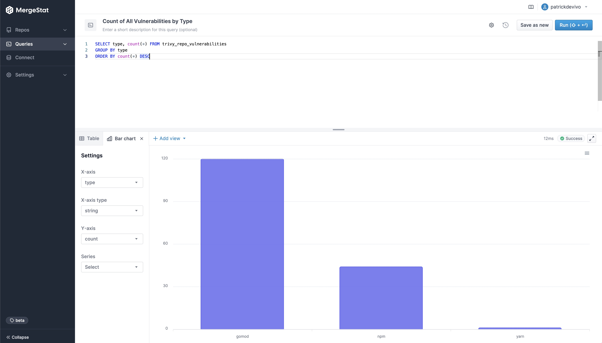

# Open-Source Vulnerability Management w/ MergeStat 🔎

[MergeStat](https://www.mergestat.com/)’s mission is to make it possible to query *anything* that’s involved in building and shipping software with SQL.
One aspect of building and shipping software is the management of open-source security vulnerabilities in the “supply chain” of dependencies your code uses.

In this post, we’ll explore how [MergeStat](https://github.com/mergestat/mergestat)’s integration with code scanners [Grype](https://github.com/anchore/grype) and [Trivy](https://github.com/aquasecurity/trivy) allows us to put together an open-source solution for managing vulnerabilities across **many** Git repositories.

:::info

Today, repo data sources are defined in the MergeStat *code*. We're [working](https://github.com/mergestat/mergestat/discussions/704) on support for a "bring your own" tool approach that would enable anyone to configure their own scanners or scripts in MergeStat.

:::


## Setup

To get started, you'll want an instance of [MergeStat](https://github.com/mergestat/mergestat) (check out how to get started [locally](/mergestat/getting-started/running-locally/)).
Once you've [added](/mergestat/setup/repo-auto-imports) your Git repos, turn on the [Grype](https://github.com/anchore/grype) and [Trivy](https://github.com/aquasecurity/trivy) scanner syncs:

[](scanner-config.jpg)

Runs of these syncs should begin populating the following views:

- `grype_repo_vulnerabilities`
- `trivy_repo_vulnerabilities`

Where each row is a vulnerability detected in a repo by one of the tools.

Now, let's see how we can query these vulnerabilities to get a sense of where (what repos) we have the most vulnerabilities in, and what the severity make up looks like.

## Total Vulnerability Count by Repo

These queries look at the total counts of vulnerabilities surfaced in each of the codebases in [MergeStat](https://github.com/mergestat/mergestat).

```sql
-- Count of trivy vulnerabilities by repo
SELECT repo, count(*) FROM trivy_repo_vulnerabilities
JOIN repos ON trivy_repo_vulnerabilities.repo_id = repos.id
GROUP BY repo
ORDER BY count(*) DESC
```

```sql
-- Count of grype vulnerabilities by repo
SELECT repo, count(*) FROM grype_repo_vulnerabilities
JOIN repos ON grype_repo_vulnerabilities.repo_id = repos.id
GROUP BY repo
ORDER BY count(*) DESC
```

[](trivy-vulns-by-repo.jpg)

## Vulnerability Count by Repo & Severity

These queries break out the count of vulnerabilities across codebase *and* severity.

```sql
-- Count of grype vulnerabilities by repo and severity
SELECT repo, severity, count(*)  FROM grype_repo_vulnerabilities
JOIN repos ON grype_repo_vulnerabilities.repo_id = repos.id
GROUP BY repo, severity
ORDER BY count(*) DESC
```

```sql
-- Count of trivy vulnerabilities by repo and severity
SELECT repo, vulnerability_severity, count(*)  FROM trivy_repo_vulnerabilities
JOIN repos ON trivy_repo_vulnerabilities.repo_id = repos.id
GROUP BY repo, vulnerability_severity
ORDER BY count(*) DESC
```

[](grype-vulns-by-repo-severity.jpg)

## Vulnerability Count by Type

Look at the breakdown of vulnerability counts by "type" (package ecosystem).

:::note

Interestingly, Grype reports more `npm` vulnerabilities while Trivy reports more `gomod` vulnerabilities across our repos.

:::

```sql
-- Count of trivy vulnerabilities by type
SELECT type, count(*) FROM trivy_repo_vulnerabilities
GROUP BY type
ORDER BY count(*) DESC
```

```sql
-- Count of grype vulnerabilities by type
SELECT type, count(*) FROM grype_repo_vulnerabilities
GROUP BY type
ORDER BY count(*) DESC
```
[](trivy-vulns-by-type.jpg)

## Most Common Vulnerabilities

Find which vulnerabilities you're most exposed to by surfacing the most commonly found ones (by CVE ID) in your codebases.

```sql
-- Count of trivy vulnerabilities by id
SELECT count(*) vulnerability_id, vulnerability_title, type FROM trivy_repo_vulnerabilities
GROUP BY vulnerability_id, vulnerability_title, type
ORDER BY count(*) DESC
```

```sql
-- Count of grype vulnerabilties by id
SELECT count(*), id, description, type FROM grype_repo_vulnerabilities
GROUP BY id, description, type
ORDER BY count(*) DESC
```

# Additional Exploration

Hopefully these queries and screenshots give a sense of what's possible when it comes to understanding CVEs across your organization using MergeStat SQL.
Some additional queries and explorations that could be interesting:

- Join CVE data with Git activity to order by the *recency* of commits in code (filter out abandoned codebases where the last commit was over a year ago)
- Determine if certain teams or projects do a better job at managing CVEs
- Alert when new `CRITICAL` vulnerabilities are detected using a direct SQL integration
- Connect a BI tool directly to the MergeStat PostgreSQL instance to see vulnerability data in a single dashboard

:::info Join our Slack

Our [**community Slack**](https://join.slack.com/t/mergestatcommunity/shared_invite/zt-xvvtvcz9-w3JJVIdhLgEWrVrKKNXOYg) is a great place to find help and ask questions. We're always happy to chat about **MergeStat** there 🎉!

:::
