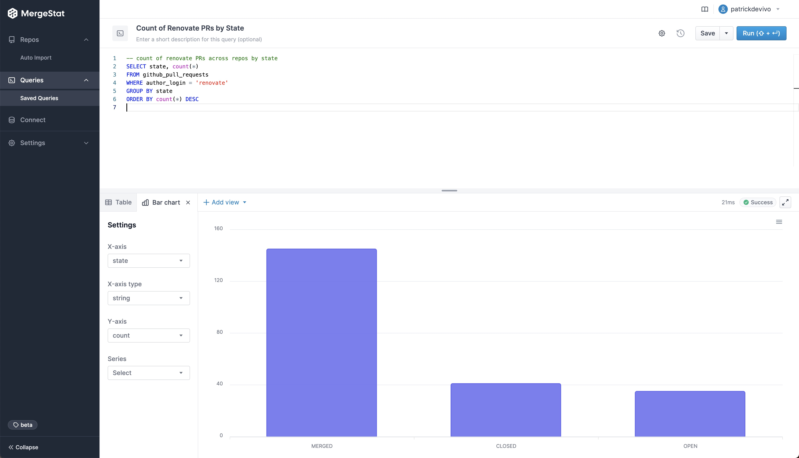
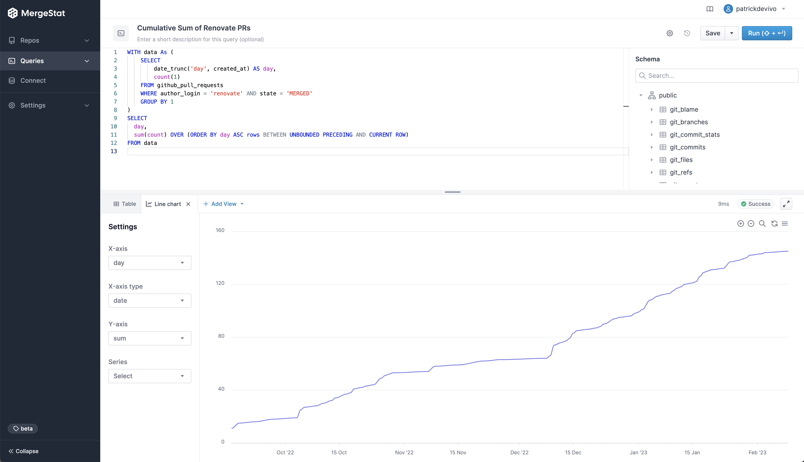
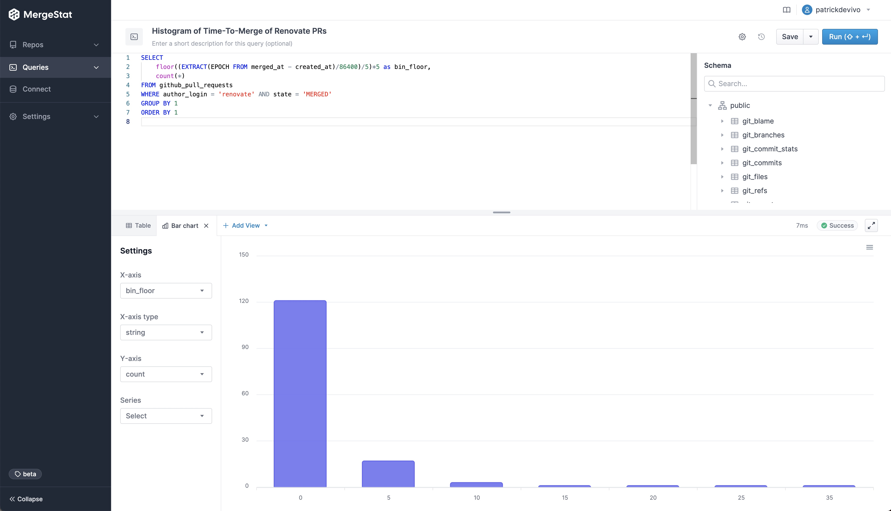

# Querying Renovate Bot Across Repos w/ SQL

We've been big fans of [Renovate](https://www.mend.io/free-developer-tools/renovate/), an open-source tool and [GitHub app](https://github.com/marketplace/renovate) that automates dependency management by opening PRs into your repos.
In particular, we've loved:

- The breadth of supported dependency types, including Dockerfiles, Helm Charts and GitHub Actions
- PRs are rate limited, so that we're not overwhelmed with code changes to review
- Respect for [conventional commits](https://www.conventionalcommits.org/en/v1.0.0/)

Recently, we wanted to know **which of our repos had Renovate installed**, which is a use case several folks have now shared with us!
This post showcases some of the queries we put together around our use of Renovate.

We [spun up](/mergestat/getting-started/running-locally/) an instance of [MergeStat](https://github.com/mergestat/mergestat) and begin writing some queries 🎉.

## Which Codebases Have Renovate Installed?

Get the list of repos that have Renovate installed (by looking for a `renovate.json` config file in the root of the repo).

```sql
-- which repos have a renovate.json file in the root
SELECT repo, path FROM git_files
JOIN repos ON git_files.repo_id = repos.id
WHERE path = 'renovate.json'
```

Retrieve when the `renovate.json` file was added to a codebase, by looking at the commit history.

```sql
-- how long ago (in days) were renovate.json files added to our repos
SELECT
    repo,
    max(author_when) AS last_modified,
    ROUND(EXTRACT(EPOCH FROM now() - max(author_when))/86400, 2) AS last_modified_days_ago,
    min(author_when) AS first_added,
    ROUND(EXTRACT(EPOCH FROM now() - min(author_when))/86400, 2) AS first_added_days_ago
FROM git_commit_stats
JOIN git_commits ON git_commit_stats.commit_hash = git_commits.hash
JOIN repos ON git_commit_stats.repo_id = repos.id
WHERE file_path = 'renovate.json'
GROUP BY repo
ORDER BY first_added ASC
```

[](renovate-config-days-since-added.jpg)

## How Many Renovate PRs Have Been Opened?

```sql
-- total count of renovate PRs across repos
SELECT count(*) FROM github_pull_requests
WHERE author_login = 'renovate'
```

```sql
-- count of renovate PRs across repos by state
SELECT state, count(*)
FROM github_pull_requests
WHERE author_login = 'renovate'
GROUP BY state
ORDER BY count(*) DESC
```

[](renovate-prs-by-state.jpg)

## What Files Does Renovate Typically Modify?

When a Renovate PR merges, what files is it typically making changes to?

```sql
-- count of modifications made by Renovate to specific files
SELECT file_path, count(*) FROM git_commits
JOIN git_commit_stats ON git_commits.hash = git_commit_stats.commit_hash
JOIN repos ON git_commits.repo_id = repos.id
WHERE author_name = 'renovate[bot]'
GROUP BY file_path
ORDER BY count(*) DESC
```

Here's example output from our codebases:

|file_path                                    |count|
|---------------------------------------------|-----|
|package-lock.json                            |259  |
|package.json                                 |231  |
|go.mod                                       |37   |
|go.sum                                       |36   |
|.nvmrc                                       |12   |
|.github/workflows/linter.yaml                |6    |
|.github/workflows/lint-test.yaml             |6    |
|renovate.json                                |6    |
|.github/workflows/release.yml                |5    |
|.github/workflows/chromatic.yml              |4    |

## Show the Cumulative Sum of Merged Renovate PRs

How much has Renovate actually been up to - and how much value are we getting from it over time?

```sql
-- calculate the cumulative sum of merged renovate PRs over time
WITH data As (
    SELECT
        date_trunc('day', created_at) AS day,
        count(1)
    FROM github_pull_requests
    WHERE author_login = 'renovate' AND state = 'MERGED'
    GROUP BY 1
)
SELECT
    day,
    sum(count) OVER (ORDER BY day ASC rows BETWEEN UNBOUNDED PRECEDING AND CURRENT ROW)
FROM data
```

[](cumulative-sum-renovate.jpg)

## How Quickly Are Renovate PRs Merged?

What's the distribution of time-to-merge (measured as the number of days between PR creation and merge) of Renovate PRs.

```sql
SELECT
    FLOOR((EXTRACT(EPOCH FROM merged_at - created_at)/86400)/5)*5 as bin_floor,
    count(*)
FROM github_pull_requests
WHERE author_login = 'renovate' AND state = 'MERGED'
GROUP BY 1
ORDER BY 1
```

[](histogram-renovate-time-to-merge.jpg)

# Conclusion

We were curious to play around with this data to learn about our use of Renovate and the value we've been getting from it.
If you're a Renovate user, hopefully it's interesting to you as well!

:::info Join our Slack

If this you found this interesting, hop in our [**community Slack**](https://join.slack.com/t/mergestatcommunity/shared_invite/zt-xvvtvcz9-w3JJVIdhLgEWrVrKKNXOYg)! We're always happy to chat about **MergeStat** there 🎉.

:::