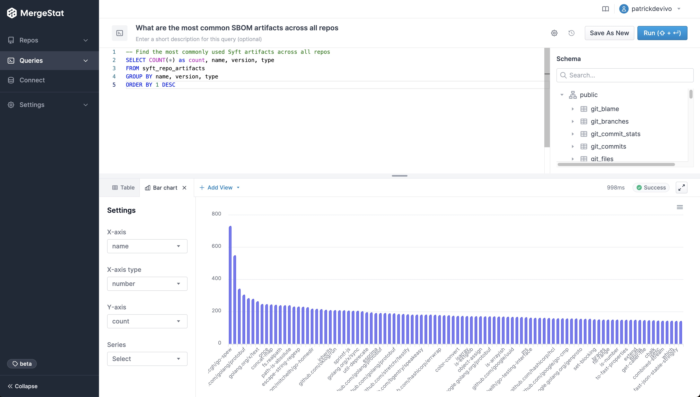

:::info *Guest Post*
This is a guest post by [**Peter Freiberg**](https://www.linkedin.com/in/peterfreiberg/), a DevSecOps and application security consultant based in Melbourne, Australia.

*I am a consultant who specialises in Application Security and DevSecOps. I've built teams and capabilities for organisations around Penetration Testing (ethical hacking), Secure Code Reviews, DevSecOps, Security Test Automation, Security Development Lifecycle and training.*
:::

# Identifying Open-Source Library Risk Using MergeStat (Part 1)

One topic that arises frequently in my work is understanding **what open-source code is in use in an organisation, and where that organisation may have vulnerabilities.** Moreover, how do we ensure *consistent* visibility into our open-source risk profile over time?

Large organisations often have a lot of code, a lot of developers, and a lot of dependencies. This can make it feel like quite a daunting task, and it’s often difficult to know where to begin. The reality, however, is that with a couple of open-source tools, almost every company can easily get accurate information on a great many topics if they know where to look and how to use their data. There’s so much useful data within Git, but not many people are using it today. 

[MergeStat](https://github.com/mergestat/mergestat) is one such tool that can help, and here we’ll showcase some queries that can assess open-source library risk and identify the general development landscape across code in an organisation. MergeStat allows you to query all your Git repositories using SQL, to start asking questions like:

- Where in our organisation do we use maven (`pom.xml`) or other package managers of interest?
- I’ve found a security issue in our dependencies, which developer modified this last so I can collaborate on remediation?
- What’s our technology and language landscape?

Being able to query code ourselves saves a lot of time, the data is the data, it’s actually what’s happened versus surveys, emails and spreadsheets that take weeks to collate and analyse. 

I think it’s really useful for AppSec or DevSecOps people to be able to query and analyse code at scale, and then proactively reach out to developers. 

We’re going to explore a few use cases for querying an organisation’s code bases, with a little help from automation and some data augmentation, to identify some specific areas of risk. 

### Show me XYZ open source package manager files, so I can look for known vulnerabilities

In this example, we’re simply going to look for known package manager file types, in this case maven.

```sql
-- Find all maven (pom.xml) files across the enterprise 
SELECT repo, path 
FROM git_files
INNER JOIN repos ON git_files.repo_id = repos.id
WHERE path LIKE '%pom.xml%'
```

From this generated list of files, we can do our own analysis. If you’re already using an SCA tool for your organisation you can also run your own analysis. Keep in mind that having a security tool for your organisation, doesn’t mean everyone is using it (yet).  

If we find a potential vulnerability in a file, we can also query who the last author (developer) was and who committed it to the repo again using another query:

```sql
SELECT author_email, author_when, committer_email, committer_when
FROM git_commits
JOIN git_commit_stats ON git_commits.hash = git_commit_stats.commit_hash
JOIN repos ON git_commits.repo_id = repos.id
WHERE file_path = 'PATH/TO/THE-FILE.extenstion' AND 
repo = 'https://github.com/YOUR_ORG/REPO'
LIMIT 1
```

While the last developer or committer may not have *added* the library which has the issue, at least they have looked at the file recently and in a good position to collaborate with us.

### Across all our Git repos, show the most frequently used 3rd party dependencies

One of the first and most fundamental challenges is simply understanding what 3rd party, open-source code a company uses. This is often difficult to aggregate across many code bases and teams.

It can be trivial to access this information in a **single** repo, but across many (hundreds or even thousands), it can be much more difficult, at least without some automation (or a tool like [MergeStat](https://github.com/mergestat/mergestat)). 

MergeStat is able to run open-source SBOM generators on all the Git repositories in an organisation, and store their output in PostgreSQL. In this example, [Syft](https://github.com/anchore/syft) is used to generate and store SBOMs for supported package managers, allowing us to execute a query like this one:

```sql
-- Find the most commonly used Syft artifacts across all repos
SELECT COUNT(*) as count, name, version, type
FROM syft_repo_artifacts
GROUP BY name, version, type
ORDER BY 1 DESC
```

This gives us the most common SBOM artifacts in use across all repositories. This is a great starting point, as it gives us a sense of what languages and tools are in use throughout a company’s code. This is an “out of the box” feature that MergeStat provides. 

It also gives us a list of any “key” dependencies - the 3rd party libraries that are most commonly relied on throughout an organisation.

[](most-common-sbom-artifacts.jpg)

### Show me the oldest files that contain security vulnerabilities

Similar to how MergeStat can generate an SBOM across many repos, it can run a vulnerability scan using a tool such as [Trivy](https://github.com/aquasecurity/trivy) or [Grype](https://github.com/anchore/grype). Doing so allows us to surface detected vulnerabilities across the repos in an organisation. Combining this with Git activity allows us to also filter vulnerabilities based on **when** the related file was last modified. This allows us to order by the vulnerabilities in the least recently modified files first (as these may be a top priority to address, as they’ve been around for a while).

```sql
-- SELECT the top 10 oldest files that contain CRITICAL vulnerabilities
SELECT MAX(committer_when) last_commit_to_file, repo, target, vulnerability_id, vulnerability_pkg_name, vulnerability_installed_version, vulnerability_severity
FROM trivy_repo_vulnerabilities
INNER JOIN git_commit_stats ON trivy_repo_vulnerabilities.repo_id = git_commit_stats.repo_id AND trivy_repo_vulnerabilities.target = git_commit_stats.file_path
INNER JOIN git_commits ON git_commit_stats.repo_id = git_commits.repo_id AND git_commit_stats.commit_hash = git_commits.hash
INNER JOIN repos ON trivy_repo_vulnerabilities.repo_id = repos.id
WHERE vulnerability_severity = 'CRITICAL'
GROUP BY repo, target, vulnerability_id, vulnerability_pkg_name, vulnerability_installed_version, vulnerability_severity
ORDER BY 1 ASC
LIMIT 10
```

This query uses the Trivy integration to surface the top 10 oldest files (by when they were last modified) that contain a `CRITICAL` vulnerability. This serves as a starting point to identify high-priority vulnerabilities - most likely the most urgent and longest standing ones. Obviously, this query can be modified to suit your needs but it does illustrate the capability. 

The key point is that once you can easily query or find the file types you want, running frequent analysis is easier and more repeatable. 

### Show me *who* typically maintains 3rd party dependencies across codebases

It’s one thing to know where vulnerabilities are, it’s another thing entirely to find the right people and process to mitigate these vulnerabilities with patches or upgrades. The last person to modify a file is probably a good person to help investigate and fix an issue. An additional query here that’s very valuable to me, is one that shows **who are the most frequent committers to dependency manifest files in recent history**?

```sql
-- show authors with most (non-merge) commits that change package.json files in the last year
SELECT count(*), author_name, author_email, file_path, repo FROM git_commits
JOIN git_commit_stats ON git_commits.hash = git_commit_stats.commit_hash
JOIN repos ON git_commits.repo_id = repos.id
WHERE file_path LIKE '%package.json' AND author_when > now() - '1 year'::interval AND parents < 2
GROUP BY author_name, author_email, file_path, repo
ORDER BY count(*) DESC
```

The query above can be modified easily to:

- Look at `go.mod`, `requirements.txt`, `Gemfile`, etc instead for different package ecosystems
- Look at a different time frame - maybe 1 year is too long (lots of engineering churn) and 1 month is a better filter
- Filter for specific code bases - maybe you’re only concerned with one or two code bases, as that’s where your focus is.

### What Next?

These queries are a way to produce a high-level survey of the open-source risk profile of code bases across an organisation. Getting data from either direct integration of tools (e.g. Trivy, Grype) or just looking for older package manager files provides a good starting point for a security program.

These queries can be expanded on to answer additional questions:

- What teams or code bases do a better job of keeping dependencies up to date and vulnerabilities out of `main`?
- Are there individuals or teams who typically update dependencies **across** many code bases in the organisation? If so, are these good people to target for additional questions about security maintenance?

Once you have your git data sources plumbed into MergeStat, you can query as needed alternating between engaging in discovery and analysing immediate issues. 

In **Part 2**, we’ll cover how to use MergeStat to starting identify overall exposure to a **single vulnerability** (such as a `Log4Shell`) that may be thrust upon your day and answer questions in a similar way. Stay tuned!

:::info Join our Slack

If you found this interesting, hop in our [**community Slack**](https://join.slack.com/t/mergestatcommunity/shared_invite/zt-xvvtvcz9-w3JJVIdhLgEWrVrKKNXOYg)! We're always happy to chat about **MergeStat** there 🎉.

:::