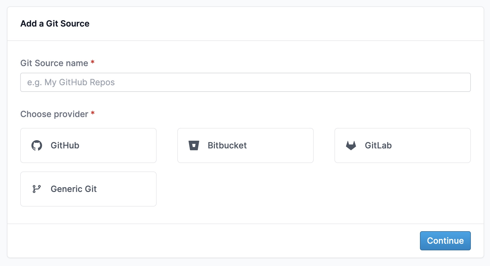

# Welcoming Bitbucket and GitLab Repos 🎉

GitHub often *feels* like the center of the developer universe, but *a lot* of developers really call [Bitbucket](https://bitbucket.org/) or [GitLab](https://about.gitlab.com/) home.
Today we're excited to announce that the [latest releases](https://github.com/mergestat/mergestat/releases) of MergeStat support Bitbucket and GitLab git repos!

This comes hot on the tails of a refactor to how MergeStat handles **Git Sources** in general, and we're really excited to have shipped support for hosts *other than* GitHub!

This is one of our more commonly requested features, and we're already beginning to work with users who primarily use Bitbucket and GitLab.

Bitbucket and GitLab [**repo auto imports**](/mergestat/setup/repo-auto-imports) are available today as well.

:::info Join our Slack

If you have questions, hop in our [**community Slack**](https://join.slack.com/t/mergestatcommunity/shared_invite/zt-xvvtvcz9-w3JJVIdhLgEWrVrKKNXOYg)! We're always happy to chat about **MergeStat** there 🎉.

:::
