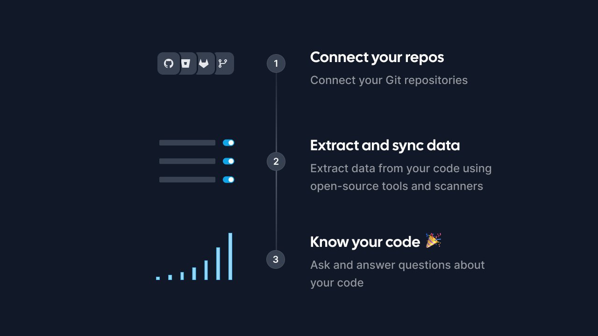
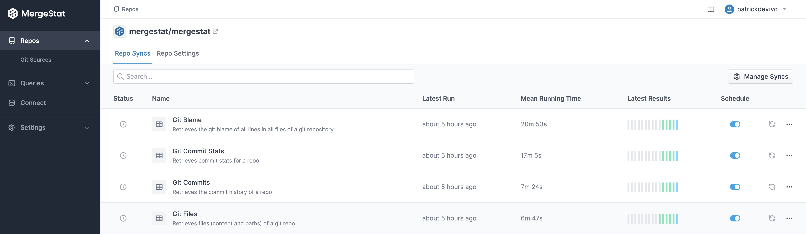

# Announcing V2: Extract & Sync Anything 🚀

<!-- TODO(patrickdevivo) add link to release -->
We're thrilled to announce the release of MergeStat v2, a completely new approach to extracting and syncing data from Git repositories and into SQL! 🎉

[MergeStat](https://www.mergestat.com/)'s mission has always been to enable anyone to ask and answer questions about *anything* involved in building and shipping software.
Today we're taking a major step closer to that reality, by supporting *container-based* syncs.

That means all the data sources [MergeStat](https://github.com/mergestat/mergestat) supports are now defined as OCI containers, and live in a separate repo: [`mergestat/syncs`](https://github.com/mergestat/syncs).

By externalizing our sync implementations, adding and using new data sources is now much easier.
This means working with data from open-source code scanners such as [`gosec`](https://github.com/mergestat/syncs/tree/main/syncs/scan-gosec) can be implemented *outside* the main MergeStat repo!

<!-- TODO(patrickdevivo) add link to release -->
**Check it out!**

For example, we recently added a new sync for [GitHub Dependabot data](https://github.com/mergestat/syncs/tree/main/syncs/github-dependabot) in this new container-based approach, allowing for queries on [Dependabot alerts](https://docs.github.com/en/code-security/dependabot/dependabot-alerts/about-dependabot-alerts) across repos.

:::info Join our Slack

Come join our [**community Slack**](https://join.slack.com/t/mergestatcommunity/shared_invite/zt-xvvtvcz9-w3JJVIdhLgEWrVrKKNXOYg)! We're always happy to chat about **MergeStat** there 🎉.

:::
