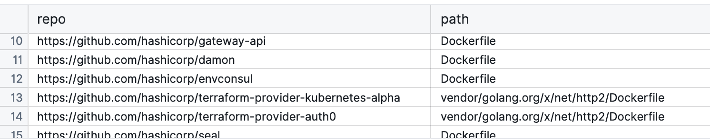
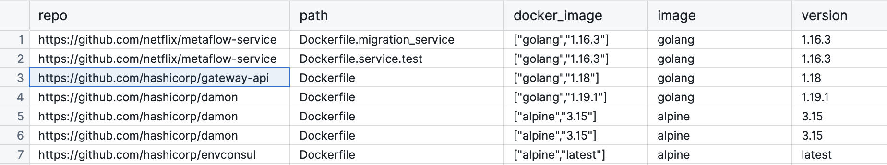

:::info *Guest Post*
This is a guest post by [**Peter Freiberg**](https://www.linkedin.com/in/peterfreiberg/), a DevSecOps and application security consultant based in Melbourne, Australia.

*I am a consultant who specialises in Application Security and DevSecOps. I've built teams and capabilities for organisations around Penetration Testing (ethical hacking), Secure Code Reviews, DevSecOps, Security Test Automation, Security Development Lifecycle and training.*
:::

In this article, we will look at processes and techniques for finding Dockerfiles across git repos, looking for specific image pinning practices.
We will use the lens of a DevSecOps persona assessing the current state of where we *are* using a #knowyourcode approach.

**TLDR:**
*Pinning Docker images is good for deterministic builds but needs to be checked regularly for security issues. **Query your code** for current practices to get a starting point.*

We’re going to explore a few key things we can search for using [MergeStat](https://github.com/mergestat/mergestat):

- Where are all of our Dockerfiles?
- Are we using `:latest` instead of a pinned version?
- For our Dockerfiles (maybe golden images), when is the last time they were modified?

For the rest of this article, we’re going to refer to “Golden images”, also called gold or base images.
By this, we mean an image built for your organisation, that handles patching and installing core libraries and frameworks required by a developer or team, rather than all teams doing it themselves.
The idea is this practice is more time efficient, reduces redundancy and creates more consistency.

We will also assume that the [MergeStat](https://github.com/mergestat/mergestat) instance we're working with has the following syncs enabled and scheduled for the repos we're looking at:

- [`git-commits`](https://github.com/mergestat/syncs/tree/main/syncs/git-commits)
- [`git-commit-stats`](https://github.com/mergestat/syncs/tree/main/syncs/git-commit-stats)
- [`git-files`](https://github.com/mergestat/syncs/tree/main/syncs/git-files)

As a DevSecOps person, we probably want to know *where* all our Dockerfiles are.
Here’s a query to do just that for everything we’ve loaded into MergeStat. 

```sql
SELECT
    repos.repo AS repo, path
FROM git_files
INNER JOIN repos ON git_files.repo_id = repos.id
WHERE path LIKE '%Dockerfile%'
```

Here are some results from public repositories that we’ve loaded into our MergeStat instance. 



These results will tell us at least where we have Dockerfiles across our code bases to understand the scope of how many we have and where they are (what repos, what directories).
It gives us a starting point for analysis and we can reach out to developers as we find issues or have questions.

From a deterministic build point of view, people tend to use a specific version of an image.
So we can query to start understanding what the current practices are around pinning to a specific version. 📌

### What are we using? (Are we using our golden images?)

If we know what our golden image naming convention is, we could start by just looking through the `FROM` statements in Dockerfiles and eyeball them.
The following query is going to show what images we are currently using across our code bases. 

```sql
WITH docker_base_images AS (
    SELECT
        repos.repo AS repo,
        path,
        (regexp_matches(contents, 'FROM (.*):(.*) AS', 'gm')) AS docker_image
    FROM git_files
    INNER JOIN repos ON git_files.repo_id = repos.id
    WHERE path LIKE '%Dockerfile%'
)
SELECT
    *,
    docker_image[1] AS image,
    docker_image[2] AS version
FROM docker_base_images
```

We’re going to get a list that looks like the following:



The results tells us that in this example, images are from Docker hub and not an organisation specific registry.
The image column would have data like `my.registry.address/repositoryname` if it was using a different registry.
This may actually be a policy you want to enforce, or detect variance: that you need to use your company's registry for all production images.

### Let’s NOT use ‘latest’ Docker images (or at least be able to find them)

Using the `:latest` tag can be good from a security patching viewpoint, but may introduce compatibility challenges in libraries and frameworks.
The following query searches for images pinned to the `:latest` tag.

```sql
WITH docker_base_images AS (
    SELECT
        repos.repo AS repo,
        path,
        (regexp_matches(contents, 'FROM (.*):(.*) AS', 'gm')) AS docker_image
    FROM git_files
    INNER JOIN repos ON git_files.repo_id = repos.id
    WHERE path LIKE '%Dockerfile%'
)
SELECT
    *,
    docker_image[1] AS image,
    docker_image[2] AS version
FROM docker_base_images
WHERE docker_image[2] = 'latest'
```

So, we should now have a list that looks like the following. 

| Repo | path | docker_image | image | version |
| --- | --- | --- | --- | --- |
| `https://github.com/Org1/xyz` | Dockerfile | ["alpine","latest"] | alpine | latest |
| `https://github.com/TeamZ/abc` | worker/Dockerfile | ["centos","latest"] | centos | latest |

Keep in mind, “latest” might not be the actual latest, it’s just a tag applied during the build process. It could even be really old if that image is no longer updated. From here, we can either reach out to the developer to understand why “latest” is being used.

### Golden images need to be maintained!

I know this sounds very obvious, but here’s a real-life example though of when a process or people breaks down:

My team was an embedded DevSecOps capability in a transformation program. We started noticing that 15+ feature teams were getting vulnerabilities in their images. After a bit of digging, we discovered the issue was the golden image had not been maintained in months. We did get a bit of noise from people saying “can we just suppress the results and release, it’s the golden image and we’re adhering to the pattern”. Turns out the maintainer of the golden image was refocused on other priorities and wasn’t actually maintaining the image. 

### When was the last time these files were modified or updated?

So, if we are starting a program to analyse our current state, looking at the age (or last modified date) of a Dockerfile could be one way of doing this. 

As of this week, there’s a new helper function in the [MergeStat](https://github.com/mergestat/mergestat) schema, *getFilesOlderThan*, which does some magic joining of tables to make things easier to query.

```sql
SELECT * 
FROM public.getFilesOlderThan('%Dockerfile', 30)
ORDER BY author_when DESC
```

From here, we can see the `author_when` column is the last time changes were made to the file, in this scenario, with the path pattern of `%Dockerfile`.

| repo | file_path | author_when | author_name | author_email | hash |
| --- | --- | --- | --- | --- | --- |
| `https://github.com/XYZ/utils` | Dockerfile | 2023-03-20T15:12:46.000Z | Bob Smith | bob@XYZ.com | sd8f67z8xvc7 |
| `https://github.com/ABC/core` | svc/Dockerfile | 2023-03-01T17:29:22.000Z | Alice Sharma | alice@ABC.COM | 98sa7s9fd32 |
| … | … | … | … | … | … |

From here, we can either look and review this file ourself, run a checker over the top (or security scan the base image) and if we’re concerned, we’ve at least got a name and email to reach out to. 

### Who are you going to call? (when you want to check something)

The above query showed the last author to edit the file. That would be the first attempt at contact if we were concerned. However, if they are not available, who else would you talk to? Here’s a query to get the last five author's details (and committer) of who’s modified a given file in a repo:

```sql
SELECT
    author_email, author_name, author_when, committer_email, committer_name, repo, file_path
FROM git_commits
INNER JOIN repos ON git_commits.repo_id = repos.id 
INNER JOIN git_commit_stats ON git_commit_stats.repo_id = git_commits.repo_id AND git_commit_stats.commit_hash = git_commits.hash AND parents < 2
AND repo ILIKE 'https://github.com/OWNER/REPO'
AND file_path ILIKE 'Dockerfile'
ORDER BY author_when DESC
LIMIT 5
```

The result is a list of the people who’ve modified the file in question for the given repository and grab the last 5. 

### We can use code analytics for security and governance

So, depending on your organisation, some policies you have can be queried in a “Governance as Code” way of doing things such as:

- Use pinned versions (e.g. no “latest”)
- Use the approved registry to build images
- Make sure our Dockerfiles are checked and updated at least every X days

As we’ve shown above, these can all be queried using [MergeStat](https://www.mergestat.com/) and SQL.
This approach can assist with identifying, remediating and managing risk.
The ability to query provides a fast approach to gaining broad visibility.

### Parting thoughts

Get started with some analysis and don’t let perfect be the enemy of good. I’ve spoken to a few people and heard comments like “That query will miss edge case XYZ”. Maybe, but you’ve got the 80-90% of a good starting point and can iterate on accuracy from that query!


:::info Join our Slack

If you found this interesting, hop in our [**community Slack**](https://join.slack.com/t/mergestatcommunity/shared_invite/zt-xvvtvcz9-w3JJVIdhLgEWrVrKKNXOYg)! We're always happy to chat about **MergeStat** there 🎉.

:::