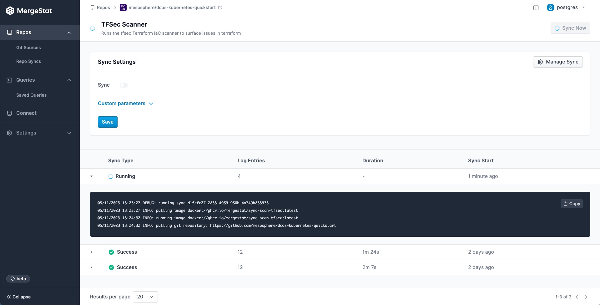
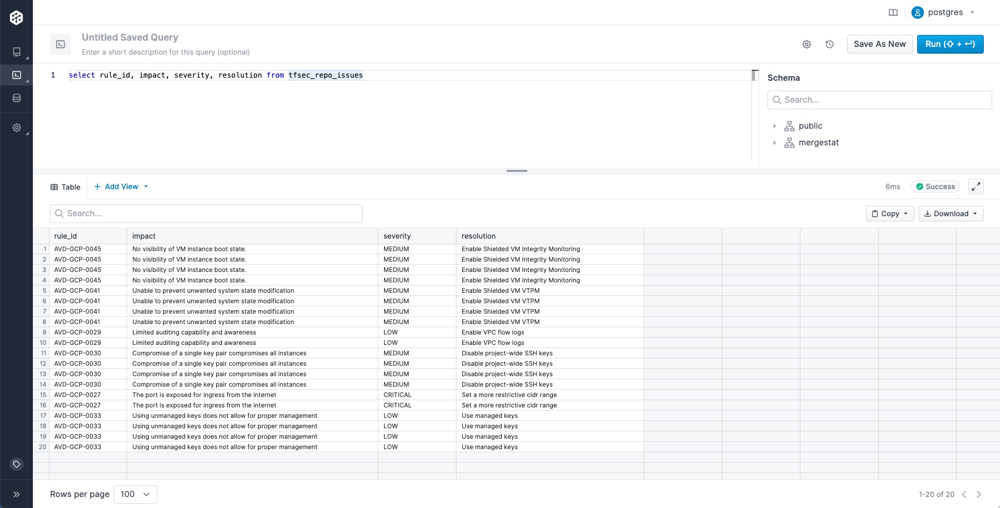

In this post we'll show how [MergeStat](https://github.com/mergestat/mergestat) can be used in conjunction with [tfsec](https://github.com/aquasecurity/tfsec), a static analysis tool for [terraform](https://www.terraform.io/), to secure cloud infrastructure 🛡️.

As a reminder, [MergeStat](https://github.com/mergestat/mergestat) accesses git repos, runs an analysis on them, and stores the results in SQL for downstream querying and operationalization:


[Our integration](https://github.com/mergestat/syncs/tree/main/syncs/scan-tfsec) with [`tfsec`](https://github.com/aquasecurity/tfsec) can be used to build a report in Grafana that surfaces terraform IaC issues and misconfigurations.
The end result here is a TFSec Grafana dashboard that can be explored and filtered, based specifically on what you're looking to target.
The dashboard looks like this:

[](grafana-example.jpg)

This dashboard is available as a JSON export [here](https://github.com/mergestat/mergestat/tree/main/examples/git/security/tfsec/grafana) and should be easy to expand on!

## The Setup

To begin scanning IaC repos with MergeStat, you'll need a MergeStat instance.
You can start locally by following [these instructions](/mergestat/getting-started/running-locally) to get a Docker Compose instance running.

You'll also want to add the `ghcr.io/mergestat/sync-scan-tfsec` sync to your MergeStat instance:

[](add-sync.jpg)

Once this sync has been scheduled and has run:

[](running-sync.jpg)

You should see a new view available to query: `tfsec_repo_issues`:

```sql
-- returns all issues found by tfsec for a given repo
SELECT * FROM tfsec_repo_issues;
```

[](tfsec-sql-query.jpg)

And that's it! You have output from `tfsec` stored in your PostgreSQL database.
Query it from [MergeStat](https://github.com/mergestat/mergestat), check out the [Grafana board](https://github.com/mergestat/mergestat/tree/main/examples/git/security/tfsec/grafana), or plug in another BI/SQL tool.

:::info Join our Slack

If you found this interesting, hop in our [**community Slack**](https://join.slack.com/t/mergestatcommunity/shared_invite/zt-xvvtvcz9-w3JJVIdhLgEWrVrKKNXOYg)! We're always happy to chat about **MergeStat** there 🎉.

:::
