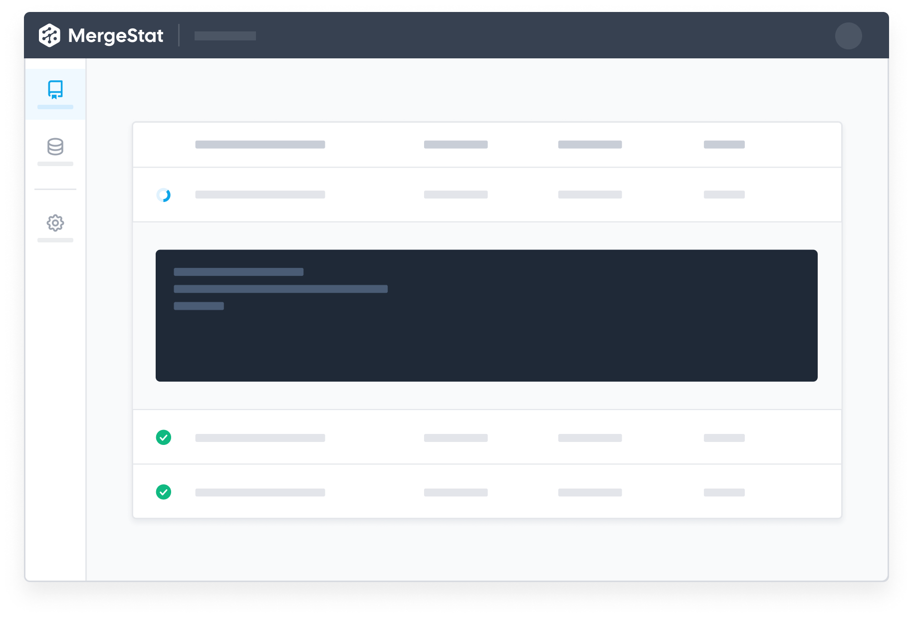

# MergeStat

[**`mergestat`**](https://github.com/mergestat/mergestat) is an open-source project to enable analytics for software engineering teams.
MergeStat enables SQL queries against data sources involved in building and shipping software, by syncing data into a PostgreSQL database.

:::note

This is a distinct project from [**`mergestat-lite`**](https://github.com/mergestat/mergestat-lite), which is our SQLite based CLI for executing SQL queries locally.

:::

To get started, you can [**run MergeStat locally**](getting-started/running-locally/README.md) with `docker-compose`.

<!--  -->
