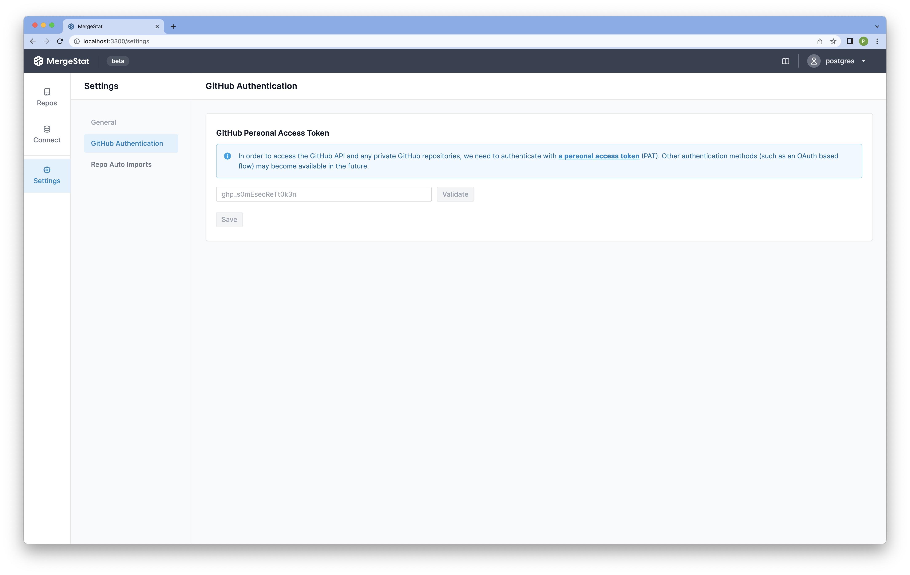

# GitHub Authentication

In order to:

1. Sync data from private GitHub repositories
2. Automatically import repos from a GitHub org
3. Run any sync that uses the GitHub API

You will need to authenticate your  GitHub **Git Source**.
Currently, the only supported authentication mechanism is with a classic [Personal Access Token (PAT)](https://docs.github.com/en/authentication/keeping-your-account-and-data-secure/creating-a-personal-access-token) (though we are working on alternatives).

You may set the GitHub authentication on the detail view of a GitHub **Git Source**.

## Sync Types

### Without a Github PAT

If you *do not* supply a GitHub PAT, the following sync types will work or not work, depending on if the repo is public or private:

|Sync Type           |Public Repo|Private Repo|
|--------------------|-----------|------------|
|`GIT_BLAME`           |✅          |❌           |
|`GIT_COMMITS`         |✅          |❌           |
|`GIT_COMMIT_STATS`    |✅          |❌           |
|`GIT_FILES`           |✅          |❌           |
|`GIT_REFS`            |✅          |❌           |
|`GITHUB_PR_COMMITS`   |❌          |❌           |
|`GITHUB_PR_REVIEWS`   |❌          |❌           |
|`GITHUB_REPO_ISSUES`  |❌          |❌           |
|`GITHUB_REPO_METADATA`|❌          |❌           |
|`GITHUB_REPO_PRS`     |❌          |❌           |
|`GITHUB_REPO_STARS`   |❌          |❌           |
|`SYFT_REPO_SCAN`      |✅          |❌           |
|`TRIVY_REPO_SCAN`     |✅          |❌           |
|`YELP_DETECT_SECRETS_REPO_SCAN`     |✅          |❌           |
|`GOSEC_REPO_SCAN`     |✅          |❌           |
|`GITLEAKS_REPO_SCAN`     |✅          |❌           |
|`OSSF_SCORECARD_REPO_SCAN`     |❌          |❌           |
|`GITHUB_ACTIONS`      |❌          |❌           |

### With a GitHub PAT

If you *do* supply a GitHub PAT, the following sync types will work with no scopes (✅) or with some required scopes (✴️):

|Sync Type           |Public Repo|Private Repo|Required Scopes for a Public Repo |Required Scopes for a Private Repo |
|--------------------|-----------|------------|-----------------------|----------------------------------|
|`GIT_BLAME`           |✅          |✴️          |-                      |`repo`                              |
|`GIT_COMMITS`         |✅          |✴️          |-                      |`repo`                              |
|`GIT_COMMIT_STATS`    |✅          |✴️          |-                      |`repo`                              |
|`GIT_FILES`           |✅          |✴️          |-                      |`repo`                              |
|`GITHUB_PR_COMMITS`   |✅          |✴️          |-                      |`repo`                              |
|`GITHUB_PR_REVIEWS`   |✅          |✴️          |-                      |`repo`                              |
|`GITHUB_REPO_ISSUES`  |✅          |✴️          |-                      |`repo`                              |
|`GITHUB_REPO_METADATA`|✅          |✴️          |-                      |`repo`                              |
|`GITHUB_REPO_PRS`     |✅          |✴️          |-                      |`repo`                              |
|`GITHUB_REPO_STARS`   |✴️         |✴️          |`user:email` OR `read:user`|(`user:email` OR `read:user`) AND `repo`|
|`GIT_REFS`            |✅          |✴️          |-                      |`repo`                              |
|`SYFT_REPO_SCAN`      |✅          |✴️          |-                      |`repo`                              |
|`TRIVY_REPO_SCAN`     |✅          |✴️          |-                      |`repo`                              |

## Repo Auto Imports

Learn more about repo auto imports [here](repo-auto-imports).

|                    |No GitHub PAT|With GitHub PAT|Required Scopes        |
|--------------------|-------------|---------------|-----------------------|
|Org                 |✅            |✴️             |read:org               |
|User                |✅            |✅              |-                      |
