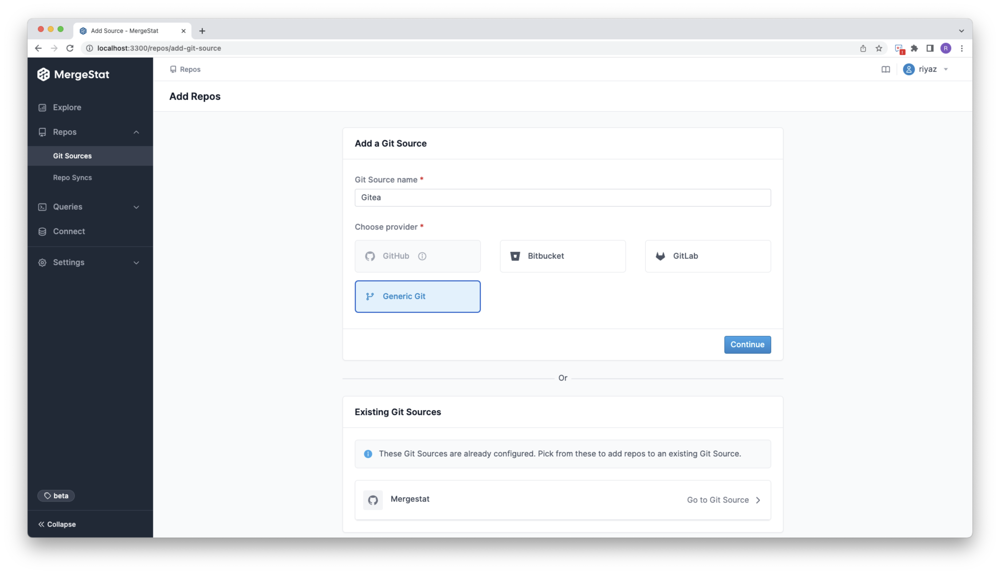

# HTTP / SSH Authentication

In order to sync data from _any_ remote `git` host (like self-hosted [Gitea](https://gitea.io/en-us/) instance or plain `ssh` servers), follow these steps:

1. Create a new `provider` using the generic `git` option



2. After creating the provider run the following query (either using `psql` or the built-in query panel):
    ```postgresql
    SELECT mergestat.add_service_auth_credential('<provider>', 'BASIC_AUTH', '<username>', '<credential>', '<secret>');
    ```

    Use either `BASIC_AUTH` (for `http`) or one of `RSA`, `DSA` or `ECDSA` (for `ssh`) credentials with the provider.
    
    Here, `<provider` is the unique identifier for the new provider (which you can find in the browser's address bar) 
    and `<secret>` is the value for the `ENCRYPTION_SECRET` environment variable.

    If you run into errors about unknown vendor / credential type, execute the following statements:

    ```postgresql
    INSERT INTO mergestat.vendors (name, display_name, description) VALUES 
    ('git', 'Generic Git', 'Access to any git repositories');
    
    INSERT INTO mergestat.service_auth_credential_types (type, description) VALUES
    ('RSA', 'Authentication using RSA Private Keys'),
    ('DSA', 'Authentication using DSA Private Keys'),
    ('ECDSA', 'Authentication using ECDSA Private Keys'),
    ('BASIC_AUTH', 'Authentication using plain username/password pair');
    ```

3. Now use the UI to add new repositories to the newly registered provider
    - For `http` use either `http://` or `https://` or `git://` as the url scheme
    - For `ssh` use `ssh://` as the url scheme