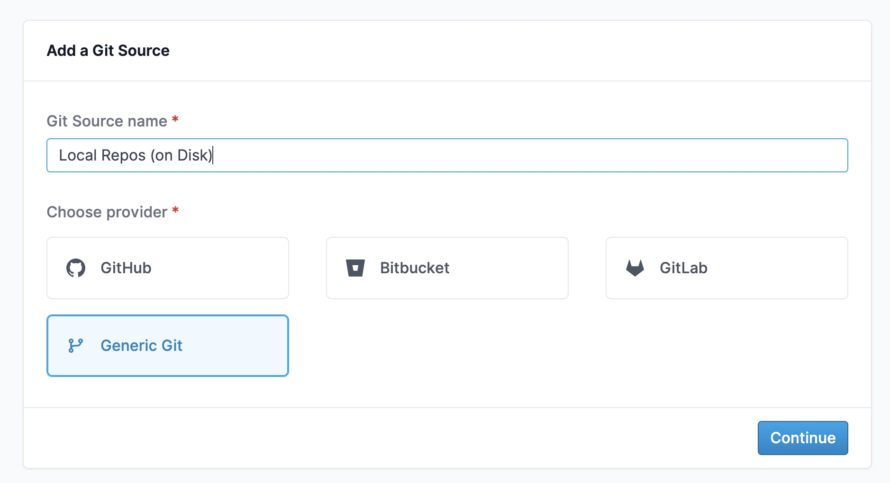

# Local (On Disk) Git Repos

:::info
Accessing on-disk git repos is currently only possible when MergeStat is running in `docker-compose`.
:::

To access local repositories (git repositories on disk), you can bind mount a local directory into the `worker` service.
To do this, add (or uncomment) the following content to the  `docker-compose.yaml` file:

```yaml
services:
  worker:
    volumes:
      - ~/projects:/projects   # ~/projects can be any local path on your host, which MergeStat will now be able to access repositories from
```

After this you can use the _manual repository import_ option to add the repository.
First, create a new **Git Source** for local repos:




Now you can add repos to this **Git Source** using `file://` as the url scheme and the _absolute path_ to the repository within the container, for example, `file:///projects/mergestat`.


