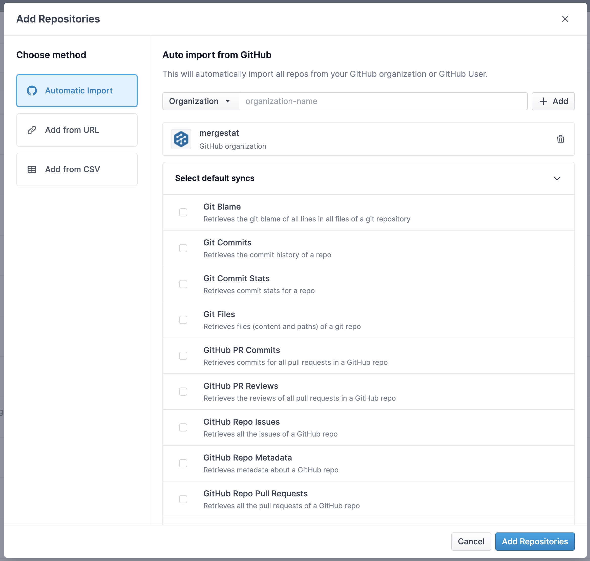

# Repo Auto Imports

Repo auto imports can be configured to *automatically* import new repositories from a GitHub organization or user.
This allows you to setup MergeStat without needing to continually add new repos as they are created (or deleted) from GitHub.

When adding a repository, choose the **Automatic import** option to define a new repo auto import.
Repo auto imports may also be configured to setup newly imported repos with a default sync type enabled.

