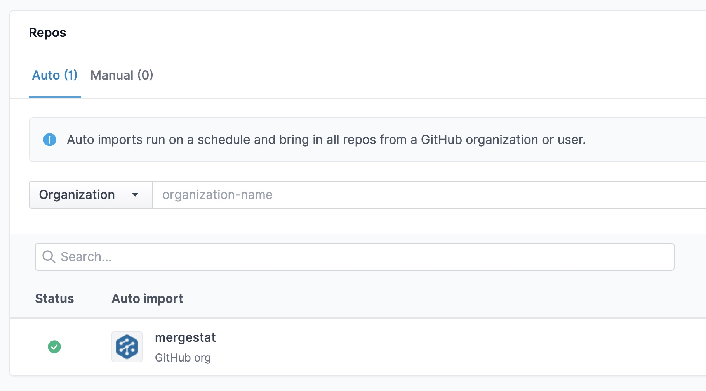

# Repo Auto Imports

Repo auto imports can be configured to *automatically* import new repositories from an organization or user in an underlying **Git Source**.
This allows you to setup a MergeStat instance without needing to continually add new repos as they are created (or deleted) in your git host.

When adding a repository, choose the **Auto** option to define a new repo auto import.
Repo auto imports may also be configured to setup newly imported repos with a default sync enabled.
This allows you to automatically bring in *data* for new repos as well.

