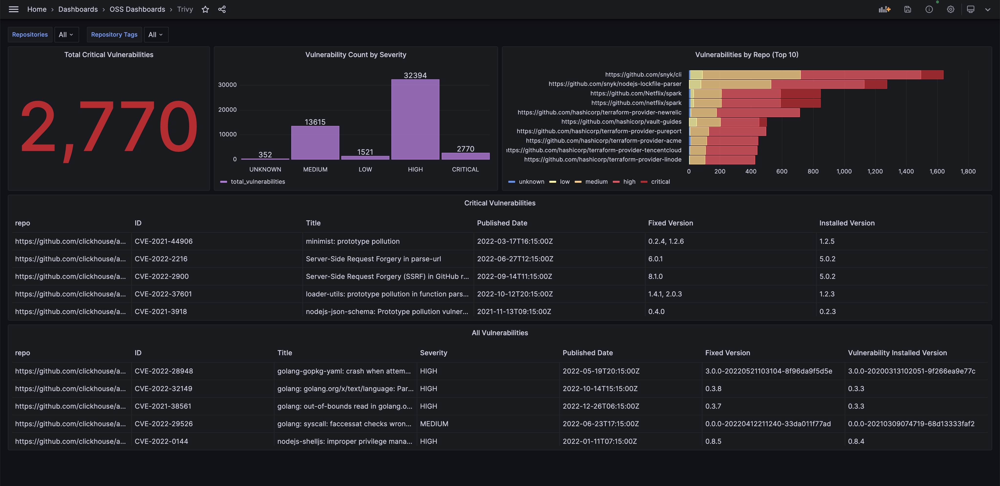
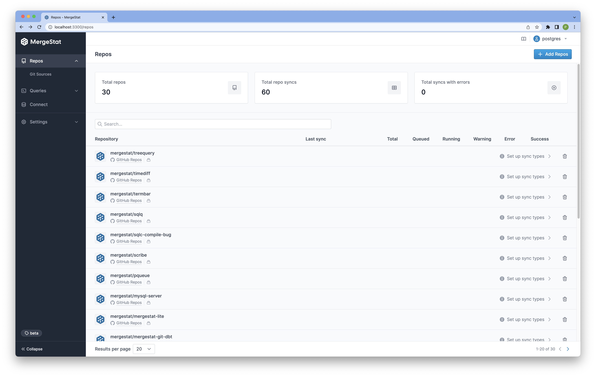
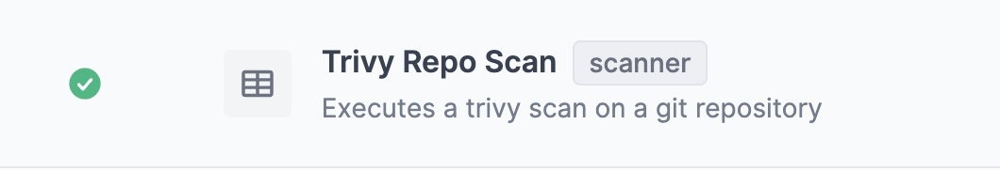
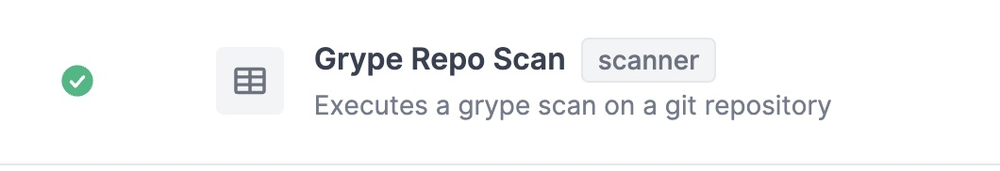

# CVE Management & Reporting

If you've spent much time around code, you probably know that [CVEs](https://en.wikipedia.org/wiki/Common_Vulnerabilities_and_Exposures) (common vulnerabilities and exposures) are a fact of life.
As such, CVE *management and mitigation* is a key part of an organization's practices in [AppSec](https://en.wikipedia.org/wiki/Application_security) and [DevSecOps](https://www.redhat.com/en/topics/devops/what-is-devsecops).

Through our support for common open-source CVE detection tools, [MergeStat](https://github.com/mergestat/mergestat) can be used as a **purely open-source** solution for reporting on CVEs detected across source code.

It's very important for organizations of *any* size to apply best practices in **source code security**, as the potential impact of not doing so could be *catastrophic*, as recent high profile security breaches frequently remind us.

MergeStat can be used to gain **visibility into CVEs detected across *all* codebases in an organization** (across multiple Git providers if necessary).
This is valuable for:

- A point-in-time overview of an organization's security posture (with respect to CVE management)
- Driving initiatives to reduce `CRITICAL` and `HIGH` severity CVEs across the org
- Prioritizing efforts around AppSec and DevSecOps best practices
- Identifying which code bases (or teams) require more support or security investment
- Generally querying (ad-hoc questings) and reporting on the presence of known CVEs throughout an organization

[](grafana-example.jpg)
*Screenshot of a MergeStat CVE dashboard in Grafana using data from [Trivy](https://github.com/aquasecurity/trivy).*

## How does it work?

1. MergeStat supports syncs that run [Trivy](https://github.com/aquasecurity/trivy) and [Grype](https://github.com/anchore/grype) (two open-source CVE scanners) on many Git repos (including across multiple hosts).
2. MergeStat orchestrates these syncs, running them regularly and storing their output in a PostgreSQL database for reporting and querying.
3. The detected CVE data may be queried with SQL in downstream reporting tools, or in the MergeStat application directly.

## Setup

To get started, first you'll need a running instance of MergeStat.
Check out our [guide here](../../../getting-started/running-locally/README.md) on running an instance locally and [adding your repos](../../../setup/repo-auto-imports.md).

[](setup-repos.jpg)

Once your repos have been added, you'll wanted to enable two syncs.
One for `Trivy`:



and another for `Grype`:



Once these have been enabled on your repos, MergeStat will regularly run scans (on the default git branch) and stash the results in Postgres.
You should now see the following tables & views begin to populate with data:

- `trivy_repo_scans`
- `trivy_repo_vulnerabilities`
- `grype_repo_scans`
- `grype_repo_vulnerabilities`

## Queries & Examples

Now that we have data flowing for all our repos from these two scanners, we can begin making use of it.
These examples will use the `trivy_*` tables, similar

### CVE Overviews

```sql
-- count which repos have the most CVEs (detected by Trivy)
-- regardless of severity
SELECT repo, count(*)  FROM trivy_repo_vulnerabilities
JOIN repos ON trivy_repo_vulnerabilities.repo_id = repos.id
GROUP BY repo
ORDER BY count(*) DESC
```

```sql
-- count which repos have the most CVEs (detected by Trivy) by severity
SELECT repo, vulnerability_severity, count(*)  FROM trivy_repo_vulnerabilities
JOIN repos ON trivy_repo_vulnerabilities.repo_id = repos.id
GROUP BY repo, vulnerability_severity
ORDER BY vulnerability_severity, count(*) DESC
```

```sql
-- Count of CVEs (detected by Trivy) by type
SELECT type, count(*) FROM trivy_repo_vulnerabilities
GROUP BY type
ORDER BY count(*) DESC
```

```sql
-- Count of trivy vulnerabilities by id
SELECT count(*) vulnerability_id, vulnerability_title, type FROM trivy_repo_vulnerabilities
GROUP BY vulnerability_id, vulnerability_title, type
ORDER BY count(*) DESC
```


## Dashboard Starters

`// TODO` Coming soon! We're putting together drop-in dashboards for tools such as [Grafana](https://grafana.com/) and [Metabase](https://www.metabase.com/).
