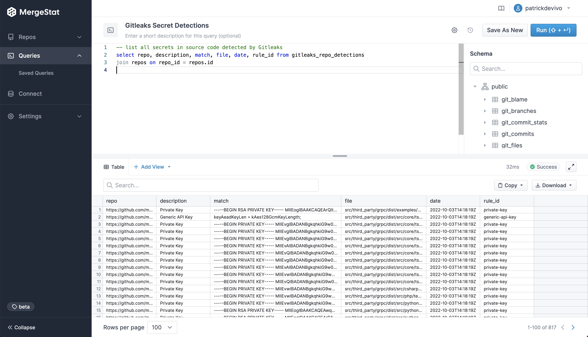

# Secret Detection

API tokens, passswords, private keys, environment variables - anything that should be treated as a "secret" sometimes find their way *committed* into source code.
This can be **big** security problem that's difficult to unwind.
Once a secret makes it into a codebase, it's visible to anyone with access to that project.
Even for internal projects, this can represent a significant risk for credentials that should only be used by an individual or particular team.

There are a number of open-source tools that can help identify and mitigate leaked secrets.
In particular, [`Yelp/detect-secrets`](https://github.com/Yelp/detect-secrets) and [`gitleaks/gitleaks`](https://github.com/gitleaks/gitleaks) detect hardcoded secrets in a git repo.

These tools, in conjunction with [MergeStat](https://github.com/mergestat/mergestat), allow users to report on and aggregate leaked secrets *across many repos* in an organization.

