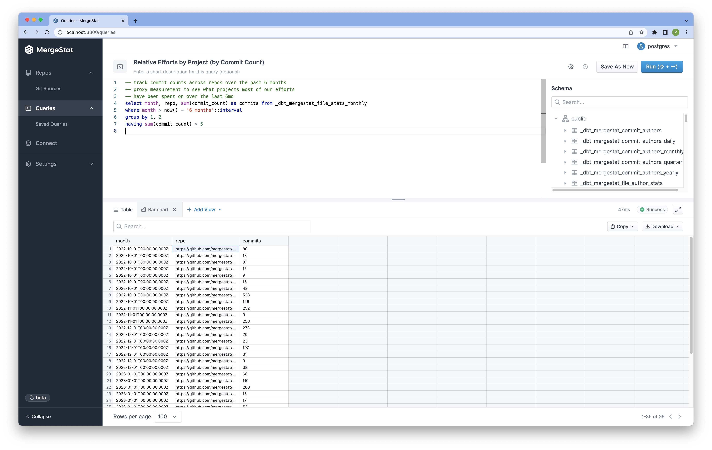

# Activity Analysis

Git history is a powerful place to look for anyone seeking to better understand code-related activities in an engineering organization.
Commit history is a high-fidelity view into the *actual* behaviors and patterns of teams, as it's directly tied to an output of engineering organizations (code).

[MergeStat](https://github.com/mergestat/mergestat) can be used to analyze git activity for various purposes.

- How frequently are we merging into `main`? (As a proxy for how effective we are at shipping code)
- Who are the "experts" in certain repos or parts of a codebase? (So we know who to target for questions)
- What parts of a project are seeing a lot of recent change (churn)? (Does this reflect a current feature initiative or do we have a flaky area in our codebase?)
- What are trends in our coding activities over time?
- How much (relative) effort is spent on what projects or parts of a codebase?
- How much (relative) effort is spent on refactoring old code vs writing new code?
- etc..

**If it's a question with an answer encoded in git history, MergeStat should be able to answer it!**

## Git Activity

By looking *only* at git commits (and associated *file changes*), we can answer some interesting questions.
MergeStat makes this *raw* data accessible through SQL for ad-hoc querying.
In addition, tools such as [dbt](https://www.getdbt.com/) can be used to define models on top of this raw data for easier use in downstream reporting and analytics.

We maintain [**this dbt project**](https://github.com/mergestat/mergestat-git-dbt) to showcase how raw git commit activity data can be turned into rollups and metrics for an analysis on the git activity of an engineering org.

:::info More on the Way!

We're putting together more examples of how git activity can be used to extract valuable insights about an engineering organization.
Stay tuned for more!

:::